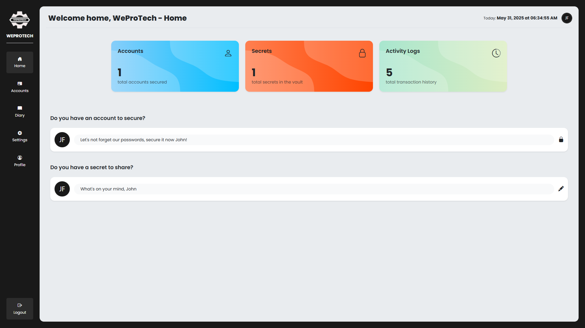

<!-- WEPROTECH Test 2-->

    <a href="#" style="color: #191919; font-weight: 800;">
    
    <h1 align="center">WEPROTECH</h1>
    </a>

# Overview

WeProTech is an web based application developed to secure secrets addressing the fundamental need for digital privacy. With features like

- Accounts Storage
- Diary

WeProTech protects secrets that only the user needs to know.

 

   

# Functionalities

### Accounts Storage
> Users sometimes tend to forget the passwords of their account. Using the same credentials when handling multiple accounts can be prone to easier data breach or even hacking. With WeProTech's accounts storage, user can now use different credentials to different application without the fear of forgetting their password. 
   
This feature provides a storage vault with data encyrption to store the user's credentias. Leveraging the functionality and features offered by Laravel, users can store their accounts and retrieve their accounts' credentials smoothly.

### Diary
> Want to vent something out but no one's there to listen? Diary let's you keep all secrets without having the fear of the tea spilling to the wrong people. This feature gives you a diary book that let's you type out all the secrets you want to spill. 

### Vault Password
> Vault Password helps you secure your secrets. This is essential and acts as a secondary layer of security when viewing your secrets. This way, even if you accidentally left your account logged in, no one can view the content of your secrets. [ Feature added and implemented but not used ].

   

# System Walkthrough

### WeProTech Landing Page
> This is the designed version of the system's landing page. This is the starting point of the system.

### WeProTech Login
> The login of WeProTech is a simple login modal component. This allows for easier integration of login to any part of the system. If the user already has an account, the user can login using this modal.

### WeProTech Registration
> Similar to the Login, the Registration is also a modal. 

### WeProTech Home Screen - Setting Up Vault Password
> Upon registration, the system will prompt you to set a vault password. This adds a secondary layer primarily used in securing the viewing of the data in your secrets.  
> [Note]. Not setting up password vault is okay, but every reload, the system will keep prompting you to set the vault password. You can't also navigate to use or navigate at all to the main features. 

### WeProTech Home Screen

> The home screen is a dashboard that display the total status of your usage. This includes cards that details the total accounts you've entrusts us, the total secets you've shared, and the total activity logs. At the bottom part, there is two cards that links you to the main features of the system.

### WeProTech Accounts Storage Page
> The accounts storage page is the page that handles the secret accounts you want to save.

> Upon clicking the eye icon, a modal appears and display the saved account information. This includes the category, account name, account email, and the password that is hidden.

> To add security, the password display initially display the encrypted version of the password. With this, even though users have unintentional access to your weprotech account, you're still protected.

> The user can only view the decrypted version of the password when show password is clicked and vault password is verified.

### WeProTech Diary Page

> The diary is where you spill all the secrets you wanna tell someone but don't trust someone enough to tell them. This feature is also encrypted with the vault password.

### WeProTech Settings Page

> The settings page lets you update your credentials. In this page, you can update login credentials or even your vault password.

### WeProTech Profile Page

> The profile page displays the overview of the user's WeProTech Account including the user's name, username, email, and account creation date. Under the profile section is the user's Activity History that records and keeps track of the user's logs that includes user's login, logout, the creation of account and main features logs(create, edit, delete).

   

# Development Team
This project is developed by the team named FSJinx consisting of two members:
- **[Reignromar Chryzel Balico](https://www.facebook.com/arsiioreo)**
- **[Eugene G. Tobias](https://www.facebook.com/EugeneNotFound)**

 

# Submission
This project is of compliance to the subject IT APP DEV 5 - Cloud Computing and is submitted to Subject Professor 
- **[John M. Facun, MSIT](https://www.facebook.com/jfacun20)**
